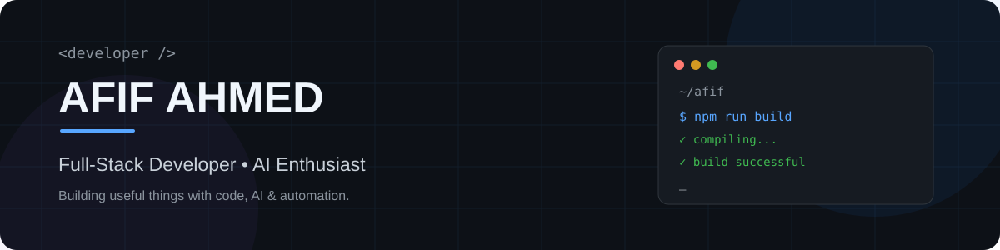

<p align="center">
  
</p>

<h1 align="center">Hi 👋, I'm Afif Ahmed</h1>

<h3 align="center">
Mechanical Engineering Student @ RUET ⚙️ | Full-Stack Developer 💻 | AI & Automation 🤖
</h3>

<p align="center">
  <a href="mailto:afifahmed0001@gmail.com">
    
  </a>
  <a href="https://github.com/afifahmedz">
    
  </a>
</p>

---

## 👨‍💻 About Me

I'm a Mechanical Engineering student at **Rajshahi University of Engineering & Technology (RUET)** exploring the intersection of **engineering, software, AI, and automation**.

- 🔭 Currently building my **full-stack development** skills
- 🌱 Learning **React, TypeScript, backend development & AI integration**
- 🤖 Exploring **AI agents and workflow automation**
- ⚙️ Interested in applying software to **real-world engineering problems**
- 🚀 Goal: Build useful products and turn ideas into working software
- 📫 Reach me at **afifahmed0001@gmail.com**

---

## 🛠️ Tech Stack

### Languages

<p>
  
  
  
  
</p>

### Frontend

<p>
  
  
  
  
</p>

### Backend & Tools

<p>
  
  
  
</p>

---

## 🌱 Currently Learning

```text
Full-Stack Development
        ↓
React + TypeScript
        ↓
Backend Development
        ↓
AI Integration
        ↓
Automation & AI Agents
        ↓
Real-World Products
